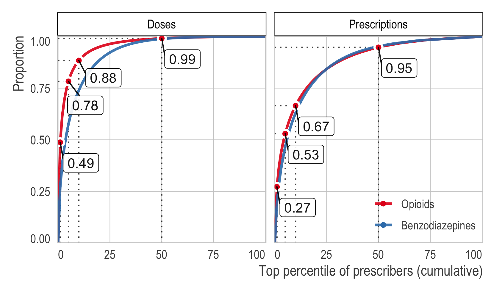

<!-- README.md is generated from README.Rmd. Please edit that file -->

# Opioid prescribing among United States medical providers, 2003-17: retrospective, observational study

## Introduction

Reproducible code for our paper, [*Opioid prescribing among United
States medical providers, 2003-17: retrospective, observational
study*](https://www.doi.org/10.1136/bmj.l6968), which uses prescription
and medical claims from
[Optum](https://www.optum.com/solutions/data-analytics/data.html) — a
large, national database of mostly private insurance claims — to
characterize trends in opioid prescribing compared to several other
drugs. The full citation is:

> Kiang MV, Humphreys K, Cullen MR, and Basu S. Opioid prescribing among
> United States medical providers, 2003-17: retrospective, observational
> study. BMJ 2020. doi:
> [10.1136/bmj.l6968](https://www.doi.org/10.1136/bmj.l6968)

We have created [**several interactive results
viewers**](https://github.com/mkiang/disproportionate_prescribing/tree/master/apps)
to assist interested readers in exploring the results and data.

### Issues

Please report issues via email or the [issues
page](https://github.com/mkiang/disproportionate_prescribing/issues).

### Note about reproducibility

~~When possible, we provide aggregated data and summary results;
however, in compliance with our data use agreement, **we cannot share
the individual-level or prescription-level data**. Further, we are
required to suppress all results based on fewer than ten providers or
ten patients.~~

**Update about data (12/31/19):** Due to restrictions on our data use
agreement, we are not able to publicly share aggregated data and summary
results in text format at this time. We are working with the data
providers to find an acceptable way to give other researchers restricted
access to these data. Updates will be provided here.

This code is provided so that researchers who have established a data
use agreement with Optum are be able to reproduce or extend our
analyses. Our code is intended to be run on a Google Cloud Compute
instance — modification will be necessary for other computing
environments.

  - See
    [`./rmds/misc_optum_files_used.html`](http://htmlpreview.github.io/?https://github.com/mkiang/disproportionate_prescribing/blob/master/rmds/misc_optum_files_used.html)
    for a list of files used in our analyses as well as the MD5 hash to
    verify versions.
  - See
    [`./rmds/misc_setting_up_GCP_instance.html`](http://htmlpreview.github.io/?https://github.com/mkiang/disproportionate_prescribing/blob/master/rmds/misc_setting_up_GCP_instance.html)
    for an example of how to set up a Google Cloud Compute instance.
  - Lastly, details about exact package versions are available in
    [`./rmds/session_information.html`](http://htmlpreview.github.io/?https://github.com/mkiang/disproportionate_prescribing/blob/master/rmds/misc_session_information.html).

## Getting the public data

See update above (12/31/19) regarding restrictions on sharing data
publicly.

## Project structure

  - `./apps/` contains the code needed to run the interactive
    applications locally. See the
    [`./apps/README.md`](https://github.com/mkiang/disproportionate_prescribing/blob/master/apps)
    file for details.
  - `./code/` contains all code needed to reproduce our analyses. This
    code is designed to be run in order. Each file is a discrete step in
    the analytic pipeline and contains a brief description of the file
    objective at the top. I describe the overarching objective of some
    of the files below.
  - `./data/` contains all aggregated and/or suppressed data that
    results from our `./code/` pipeline.
  - `./data_private/` is not on the public repo and is ignored via
    `.gitignore`. It contains the *full-sized Optum data that cannot be
    shared*. In addition, it contains other files that cannot be shared
    due to our data use agreement – for example, member or provider
    files and lookup tables.
  - `./data_private_mini/` is not on the public repo and is ignored via
    `.gitignore`. Because the full diagnostic and prescription files are
    large and cumbersome, we subset them into just the rows we need
    (i.e., prescriptions for our defined drugs), saving the files here.
    These are still *individual- and prescription-level data that cannot
    be shared*.
  - `./data_raw/` contains **publicly-available** data that will be used
    in the analytic pipeline. See the `./data_raw/README.md` for
    details.
  - `./grobs/` contains the **gr**aphical **ob**jects generated by the
    plotting code. Each object will contain the data and information
    necessary to regenerate the plots without re-running the code or
    downloading the data.
  - `./plots/` contains the manuscript-ready plots in both `pdf` and
    `png` formats.
  - `./result_objects/` contains the intermediate files generated by our
    analytic pipeline. This folder is not in the public repo and is
    ignored via `.gitignore` because it may contain personally
    identifiable information. Some code files take days to run;
    therefore, we save all intermediate files, which allows our code to
    be stopped and resumed without repeating analyses. When a task is
    completed, the intermediate files are collected and saved into
    `./data/` or `./data_private/`.
  - `./rmds/` contains all the RMarkdown files used to generate our
    tables.

## Code structure

Each code file is a discrete step in our analytic pipeline, and is
designed to be run in order (i.e., some code files depends on files
generated in previous code files). Below, I describe the overarching
objective of the files. Within each code file, there is a short
description of the objective of that file.

  - `00_download_public_data.R`: Downloads and copies the public use
    data file. You only need to run this once.
  - `00_install_necessary_packages.R`: Our compute environment is based
    on a docker image, which is wiped clean with every restart. This
    helper script simply (re-)installs the necessary packages to run the
    code.
  - `01` to `03`: Download the full prescription data and tabulate the
    number of unique prescriptions, providers, and patients.
  - `04` to `08`: Subset the full prescription data based on drug type
    and then tabulate the number of unique prescriptions, providers, and
    patients for each drug type.
  - `09`: Import, clean, and munge the provider specialty data.
  - `10`: Summarize the doses of each drug type by state and provider
    category. This includes descriptives such as the mean, median,
    standard deviation, and various quantiles.
  - `11`: Describe the inequality of the prescribing patterns nased on
    global inequality metrics (e.g., Gini coefficient) and the Lorenz
    curve.
  - `12` to `19`: Describe the prescribing patterns by centile including
    the top centile of patients, providers, and patient-provider pairs.
  - `20` to `21`: Rank the specific opioids and benzodiazepines that
    were prescribed in our data.
  - `22` to `24`: Download and subset the full diagnostic history files.
    Then tabulate the proportion of top centile patients who have
    history of cancer diagnosis as well as recent primary diagnoses.
  - `25` to `28` and `99`: Additional files that are not strictly
    necessary for the main manuscript.
  - `fig`\*: These files generate the figures used in the manuscript and
    supplemental materials.

## Authors

  - [Mathew Kiang](https://mathewkiang.com)
    (:
    [mkiang](https://github.com/mkiang) |
    :
    [@mathewkiang](https://twitter.com/mathewkiang))
  - [Keith Humphreys](https://profiles.stanford.edu/keith-humphreys)
    (:
    [@KeithNHumphreys](https://twitter.com/keithnhumphreys))
  - [Mark Cullen](https://profiles.stanford.edu/mark-cullen)
    (:
    [@MarkCullen\_PHS](https://twitter.com/markcullen_phs))
  - [Sanjay
    Basu](https://primarycare.hms.harvard.edu/faculty-staff/sanjay-basu)
    (:
    [sanjaybasu](https://github.com/sanjaybasu))
