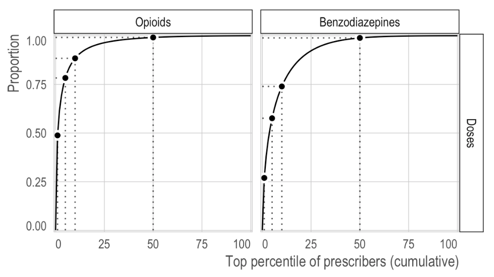
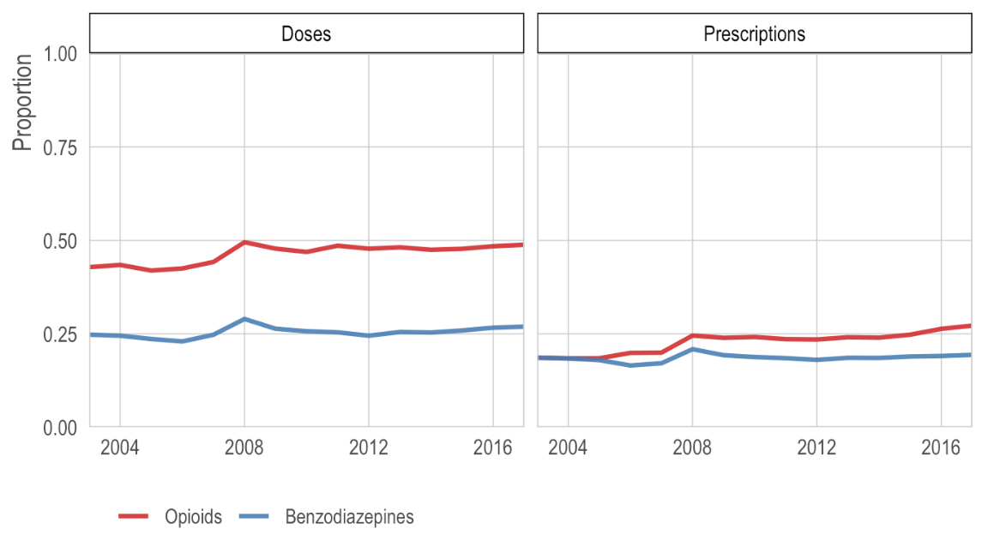
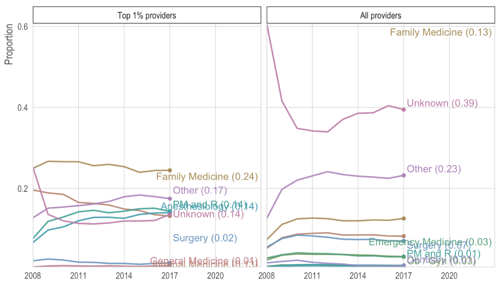
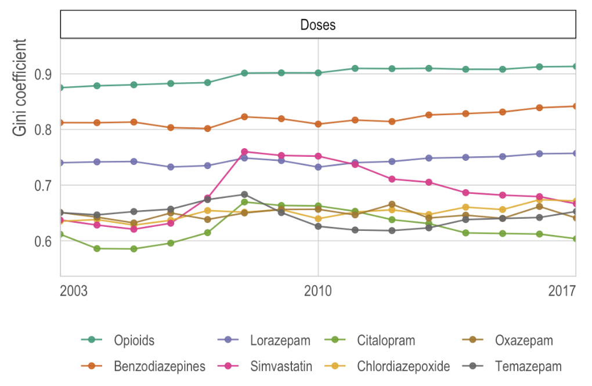
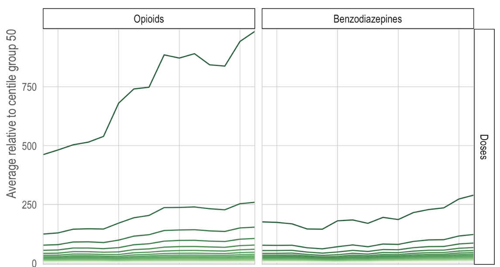

```{r setup, include=FALSE}
knitr::opts_chunk$set(echo = FALSE)
```

## Introduction

This is a list of companion applications for our paper, [*Opioid prescribing among United States medical providers, 2003-17: retrospective, observational study*](https://www.doi.org/10.1136/bmj.l6968). The full citation for this paper is: 

> Kiang MV, Humphreys K, Cullen MR, and Basu S. Opioid prescribing among United States medical providers, 2003-17: retrospective, observational study. BMJ 2020. doi: [10.1136/bmj.l6968](https://www.doi.org/10.1136/bmj.l6968)

For interested readers, we have created several interactive results viewers. These online applications allow readers to change the parameters of plots and tables in order to view results for different provider specialties, states, years, measures, drugs, or sensitivity analyses. A brief description of each app is provided below.

The code for both our paper and these apps is available online in the [official paper respository](https://mathewkiang.com/disproportionate_prescribing).

## Interactive results viewers

1. [**Prescribing patterns within a single year**](https://sanjaybasu.shinyapps.io/lorenz_curve_app/): This application is an interactive version of Figure 1 in our paper. For any specified year, it shows the cumulative proportion of drugs dispensed as a function of the cumulative proportion of ranked providers. That is, what proportion of the drug is prescribed by the top proportion of providers. It allows users to specify different sets of drugs, measures, states or provider specialty, and level of trimming (i.e., sensitivity analyses). Importantly, due to limits of the `shinyapps.io` server, this app only runs a subset of the drugs in our paper. To run it for *all* drugs, you must run the app locally. 

<p align='center'>
```{r, out.width="50%"}

```
</p>


2. [**Prescribing patterns over time**](https://sanjaybasu.shinyapps.io/prescribing_over_time_app/): This application is an interactive version of Figure 2 in our paper. It shows the proportion of different drugs prescribed by the top 1%, 5%, 10%, 25%, or 50% of providers from 2003 to 2017. It allows users to specify different sets of drugs, measures, states or provider specialty, and level of trimming (i.e., sensitivity analyses).

<p align='center'>
```{r, out.width="50%"}

```
</p>

3. [**Closer look at the top centile**](https://sanjaybasu.shinyapps.io/inequality_over_time_app/): This application allows for looking at the provider specialties in the top centile of prescribers and across all providers at different levels of trimming and different drug types (Fig. S5). In addition, it shows the centile to centile transactions of prescribing patterns for different years, drugs, and levels of trimming (Fig. 3). 

<p align='center'>
```{r, out.width="50%"}

```
</p>

4. [**Measures of global inequality in prescribing**](https://sanjaybasu.shinyapps.io/top_centile_app/): This application is an interactive version of the Gini analysis in our paper (Supplemental Materials). We measured the disproportionate level of prescribing using several metrics of inequality. In our paper, we present the Gini coefficient and show that all measures of inequality are highly correlated. This app users to specify different sets of drugs, inequality metrics, measures, states or provider specialty, and level of trimming (i.e., sensitivity analyses).

<p align='center'>
```{r, out.width="50%"}

```
</p>

5. [**Prescribing of the top providers relative to the median providers**](https://sanjaybasu.shinyapps.io/ntile_relative_app/): This application is an interactive version of Supplemental Materials Fig. S6 in our paper. As described in the paper, we divided providers into centile groups (i.e., 100 equally-sized groups) and compared the prescribing patterns of the top 25 centile groups relative to the median (50th) centile group. It allows users to specify different sets of drugs, measures, states or provider specialty, and level of trimming (i.e., sensitivity analyses).

<p align='center'>
```{r, out.width="50%"}

```
</p>
